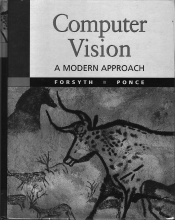
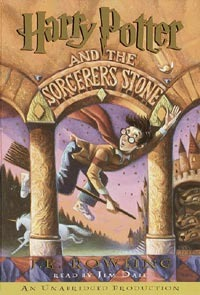
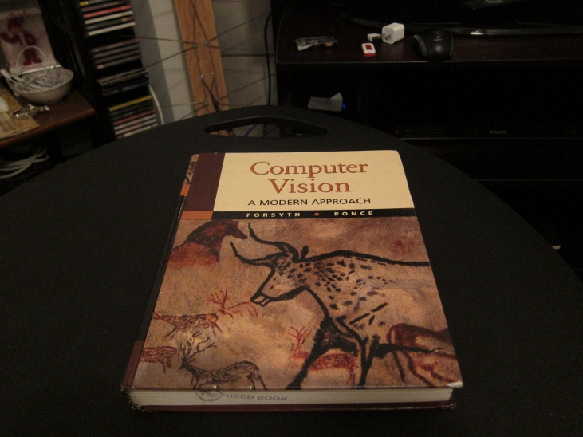
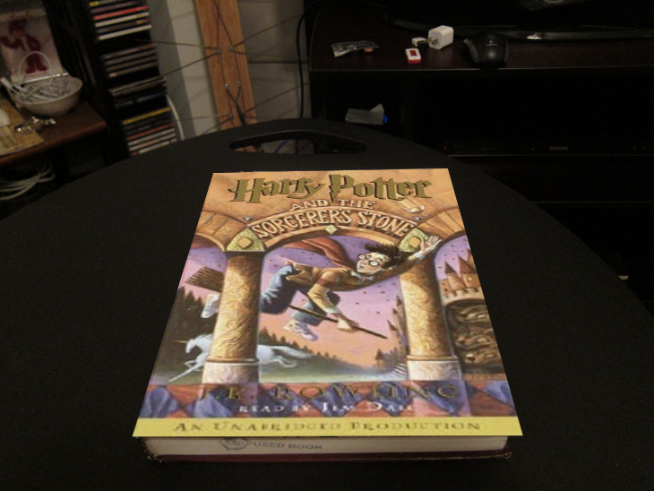
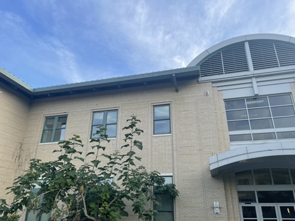
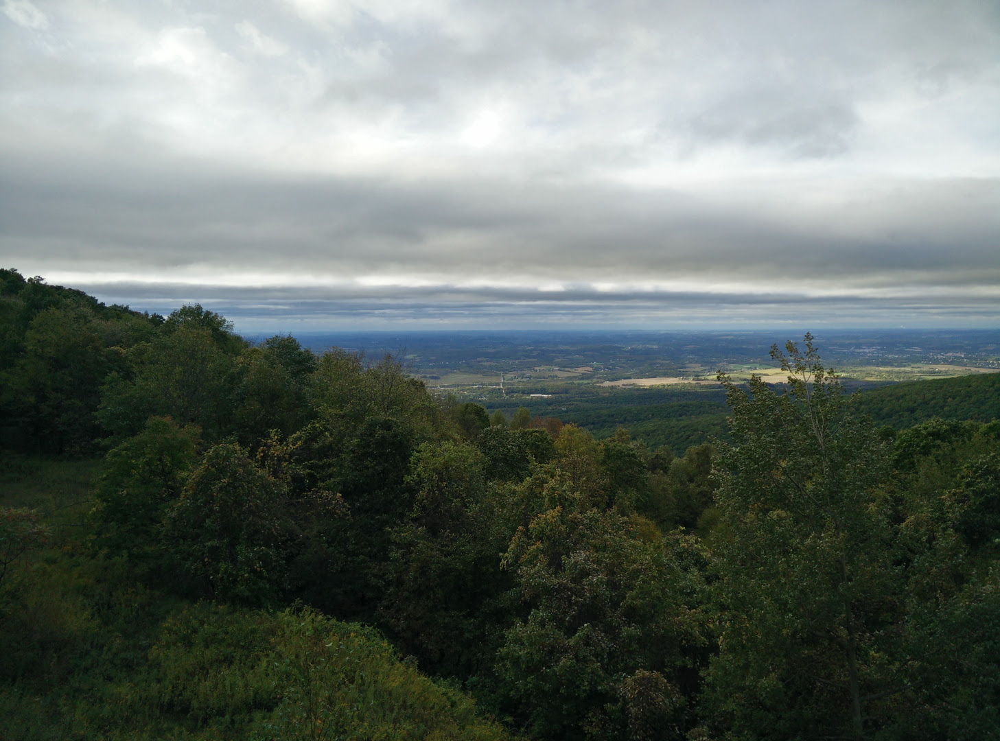
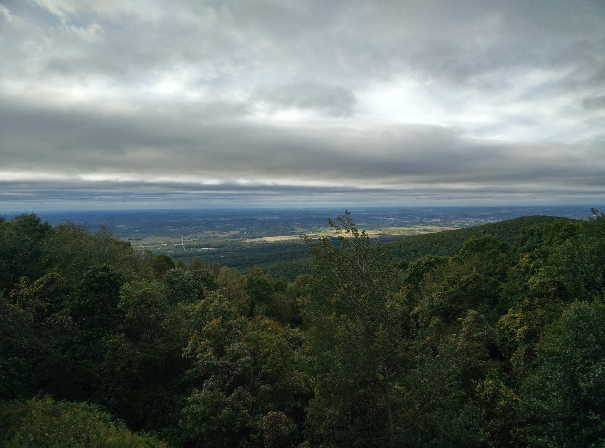

# Homography

## Finding Matches using BRIEF descriptor

## Computing Homography

### Source Images

### Destination Frame

### After Homography Transformation

## Panorama Stitching

### Example 1

#### After Stitching

### Example 2

#### After Stitching

